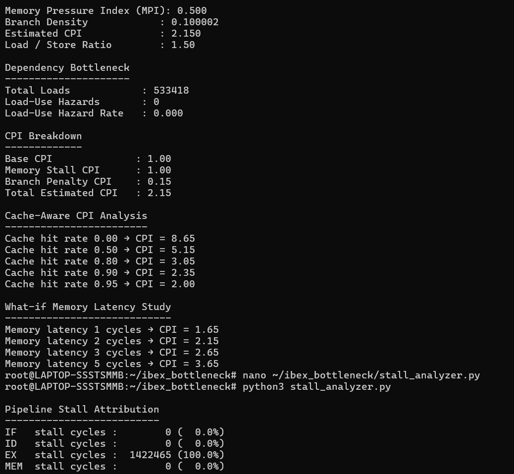
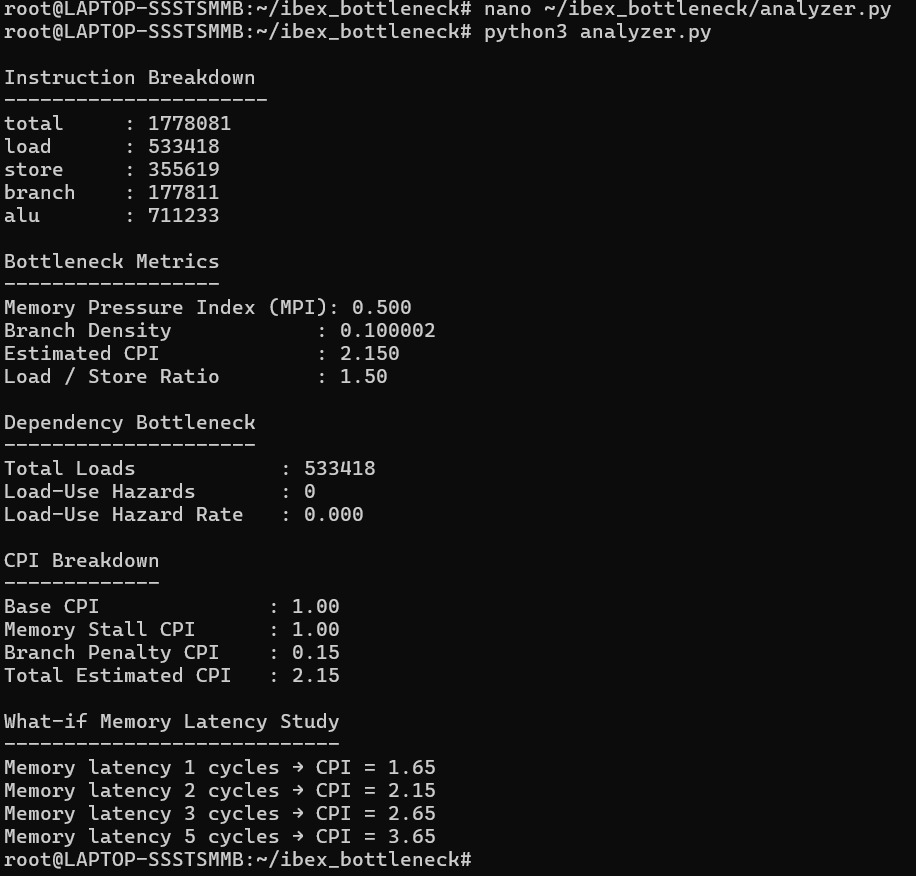
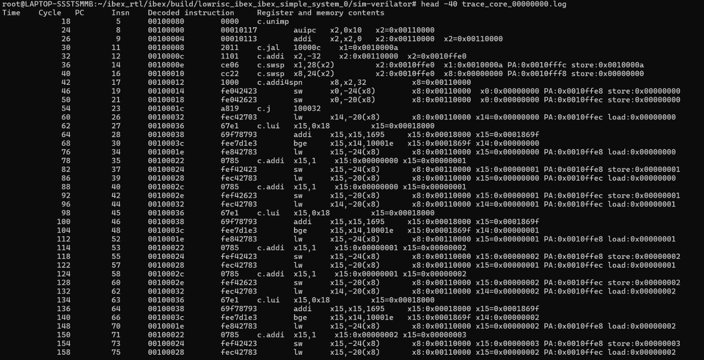
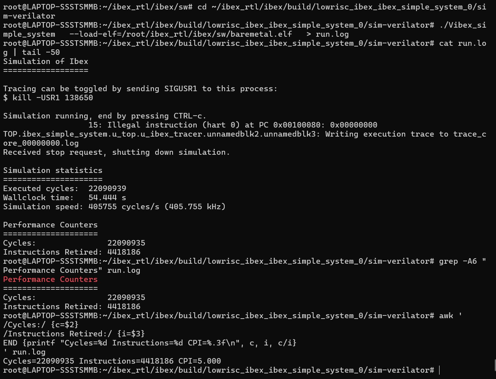
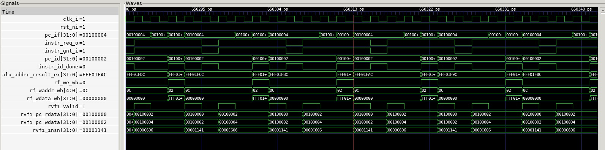
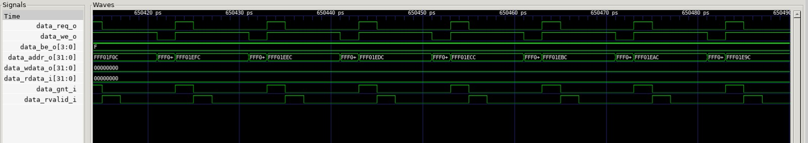
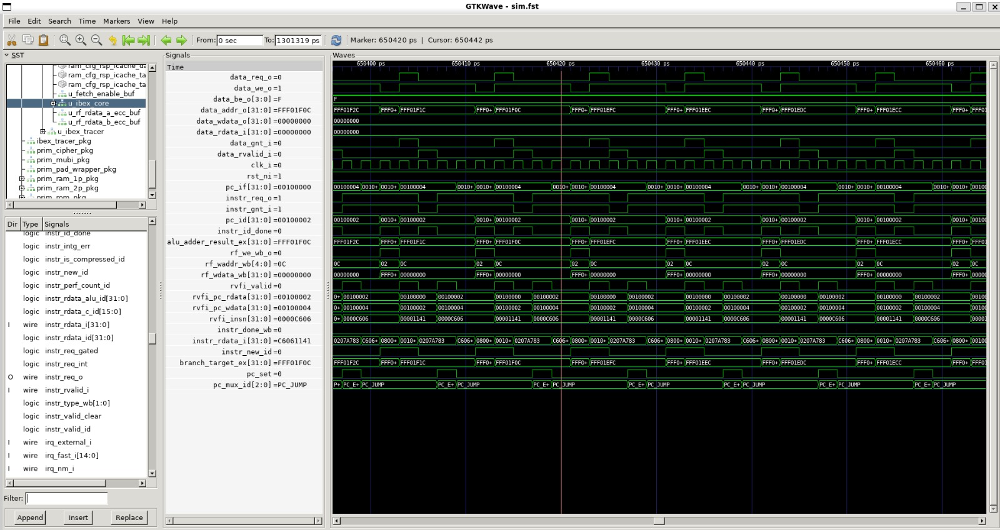
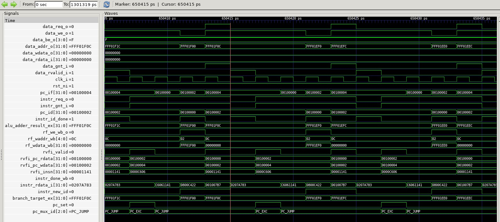
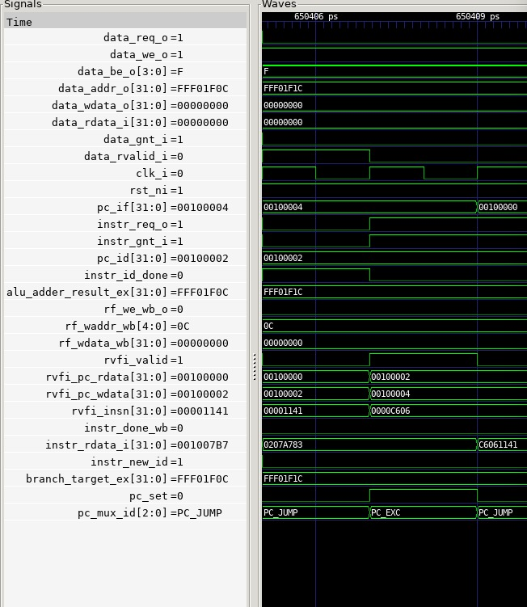

# Cycle-Accurate Microarchitectural and Pipeline Bottleneck Analysis of the Ibex RISC-V Core Using RTL Instrumentation and Real Software Workloads

This project presents a cycle-accurate microarchitectural and pipeline-level bottleneck analysis of the Ibex RISC-V core using RTL instrumentation, execution tracing, and real bare-metal software workloads.

The objective is to understand performance-limiting factors such as memory stalls, pipeline hazards, and CPI contributors directly from RTL-level behavior rather than high-level simulators.

---

## Key Contributions

- Cycle-accurate execution tracing using Verilator
- RTL-level CPI and performance counter instrumentation
- Five-stage pipeline behavior analysis
- Pipeline stall attribution (IF, ID, EX, MEM stages)
- Memory pressure and dependency bottleneck analysis
- Cache-aware and memory latency what-if CPI modeling
- Analysis using real bare-metal RISC-V workloads
- Waveform-backed validation using GTKWave

---

## Analysis Overview

### Instruction Mix Analysis
- Load, store, branch, and ALU instruction breakdown
- Memory pressure index (MPI)
- Load to store ratio

### CPI Breakdown
- Base CPI
- Memory stall CPI
- Branch penalty CPI
- Total estimated CPI

### Pipeline Stall Attribution
Stalls are classified using cycle-accurate timing into:
- Instruction Fetch (IF) stalls
- Decode (ID) stalls
- Execute (EX) stalls
- Memory (MEM) stalls

### What-If Studies
- Memory latency impact on CPI
- Cache hit-rate sensitivity analysis

---

## Tools and Environment

- Ibex RISC-V Core
- Verilator (cycle-accurate simulation)
- GTKWave (waveform analysis)
- Python (trace parsing and bottleneck analysis)
- FuseSoC
- Bare-metal RISC-V software

## Waveform-Based Performance Analysis

---

## Pipeline Waveform Analysis

The following waveform screenshots were captured from cycle-accurate
Verilator simulations and analyzed using GTKWave. These waveforms validate
the internal behavior of the 5-stage Ibex pipeline and confirm the stall
and bottleneck conclusions derived from trace-based analysis.

### Pipeline Stage Progression

These waveforms demonstrate:
- Correct instruction flow across IF, ID, EX, MEM, and WB stages
- Memory-stage dominance during stall periods
- Minimal control-hazard impact compared to memory latency
  
## Key Microarchitectural Findings

- The workload is **memory-dominated**, with ~50% of instructions being loads or stores.
- Pipeline stall attribution shows that **EX-stage stalls dominate**, indicating memory access latency as the primary bottleneck.
- Load-use hazards are minimal, confirming effective forwarding in the 5-stage Ibex pipeline.
- CPI is highly sensitive to memory latency and cache hit rate, ranging from ~8.6 (no cache) to ~2.0 (95% hit rate).
- Branch behavior contributes modestly to CPI due to low branch density.

## Pipeline and Waveform Correlation

The following waveforms illustrate instruction flow and stall behavior across the 5-stage pipeline:

- IF / ID / EX / MEM / WB stage progression
- Stall propagation during memory operations
- Correlation between execution trace timing and RTL signals

See: `waveforms/screenshots/`

## Why This Analysis Matters

This project demonstrates how cycle-accurate traces and RTL-aware analysis can be used to:
- Identify true performance bottlenecks beyond instruction counts
- Quantify the impact of memory systems on in-order pipelines
- Guide architectural decisions such as caching, prefetching, and pipeline tuning

The methodology is portable to other RISC-V cores and embedded processors.

- Branch behavior contributes modestly to CPI due to low branch density.

- Correlation between RTL-observed stalls and CPI estimates
